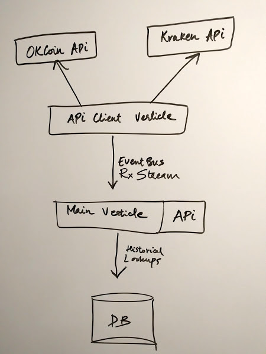

# bitcoin-exchange-rates

## Compile & Run

Dependency:
- JDK 8
- Maven 3+

To package fat jar (all deps included): 
```
mvn package
```

To run:
```
java -jar target/bitcoin-exchange-rates-1.0-SNAPSHOT-fat.jar
```


## Architecture

### Version 1: General Architecture 


### Version 2: Vert.x Architecture


### Version 3: Vert.x with RxJava Architecture 



___


### Choice of Database

This is timeseries data, so a timeseries DB like DynamoDB, Cassandra or InfluxDB would be ideally suited to storing & retreiving this data.

A DynamoDB data model would look like this:

```
exchange (hash key)
timestamp (range key)
bid
ask
last
```

Data model for Cassandra would also look identical to this.

